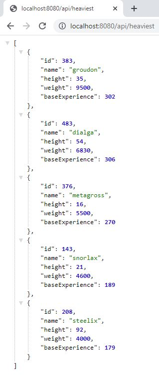
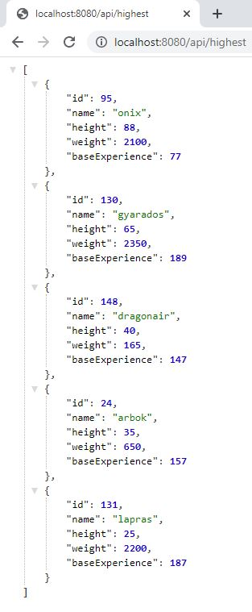
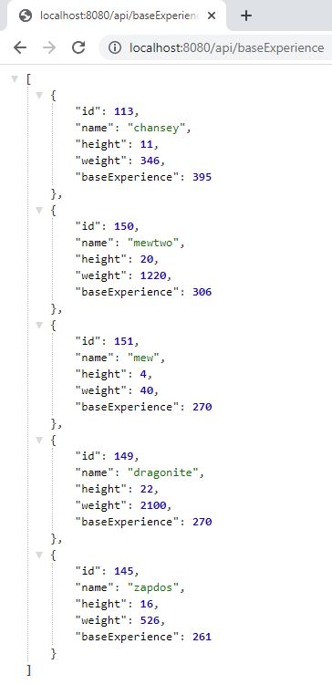

# Alesa 🎮🎰

# Summary 🤔

To complete the Backend Knowledge test, you should complete the following goals.

| Requirement                                                            | PokeAPI JSON Field |
|------------------------------------------------------------------------|--------------------|
| Show in JSON format via HTTP the 5 heaviest Pokémons.                  |      "weight"      |
| Show in JSON format via HTTP the 5 highest Pokémons.                   |      "height"      |
| Show in JSON format via HTTP the 5 Pokémons with more base experience. |  "base_experience" |

To complete this test, you must use the following prerequisites:

  1. Use Java + SpringBoot

  2. Unit Tests

  3. Use PokéAPI (https://pokeapi.co/api/v2)

  4. We only want Pokémons of “Red Version”. You are able to find this information one the section “game_indices” for each Pokémon:

        1. Version_name: red

        2. Version_url : https://pokeapi.co/api/v2/version/1

Our Recommendations:

· Project Lombok

· Use H2database if you want/need to store some information in a database instead of using an external DB.

· Spring initializr: https://start.spring.io/.                                                                                                                    |

# Results 📷
## Heaviest - Top 5️- JSON Response💪

## Highest - Top 5️- JSON Response 💪

## Base Experience - Top 5️- JSON Response 💪

## Unitary testing ✔️:

